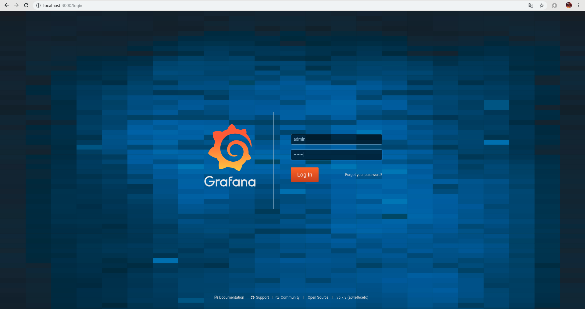
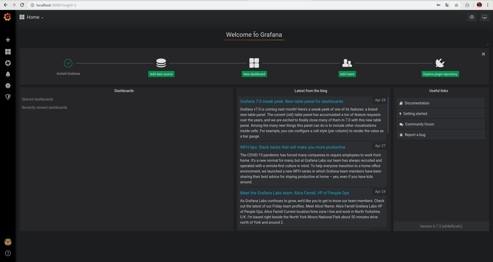
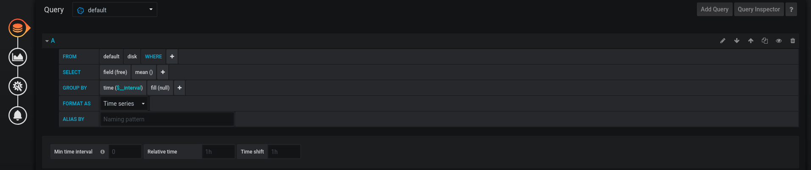

% Proyecto Grafana
% Sergi Muñoz Carmona
% 2n hisx 04/06/2020

------------------------------------------------------------------------

# Introducción

- Grafana (Características y composición).
- InfluxDB (Características y estructura de almacenamiento).
- Telegraf (Características y estructura).
- Datasources (Mysql)
- Implementación en Dockers

------------------------------------------------------------------------

# Grafana

- Grafana es una herramienta de análisis para métricas, que permite consultar,visualizar,altertar y comprender los datos independientemente de donde estén almacenados. 

- Grafana es un software libre basado en la licencia de Apache 2.0 creada por Torkel Ödegaard, en enero de 2014.


------------------------------------------------------------------------

# Características de Grafana

- Grafana tiene una gran amplitud de Dashboards y paneles.
- Grafana permite la autenticación con LDAP,TLS,Google Auth,grafana y github.
- Grafana permite el intercambio de datos y dashboards entre equipos.
- Grafana permite crear alertas de seguridad.
- Grafana ayuda a rastrear el comportamiento del usuario y de las aplicaciones.


------------------------------------------------------------------------


# Paneles de Grafana y el dashboard

- Un dashboard es un cuadro formado por un conjunto de paneles creados en grafana.
- Un panel es el bloque de construcción básico para la visualización de los datos.


------------------------------------------------------------------------

# Visualización de Grafana (1)

- Pantalla de inicio en Grafana.



------------------------------------------------------------------------

# Visualización de Grafana (2)

- Pantalla de Tareas.



------------------------------------------------------------------------

# Visualización de Grafana (3)

- Pantalla de gráficos.


------------------------------------------------------------------------

# Visualización de Grafana (4)

- Composición de la Query.




------------------------------------------------------------------------

# Visualización de Grafana (5)

- Pantalla de dashboard y paneles.


------------------------------------------------------------------------

# InfluxDB

- InfluxDB desarrollada por influxdata, es una base de datos basada en series de tiempo. (time-series database),guarda una serie de datos indexados por tiempo.

- Uno de los puntos positivos que tiene influxdb es que es una base de datos de código abierto (open source). 

------------------------------------------------------------------------

# Características de InfluxDB

- Si los datos son exactos en todos los campos, los sobreescribe.
- Los datos están compuestos con timestamp.
- La base de datos puede gestionar un gran volumen de lecturas y escrituras.
- La actualización de la base de datos esta restringida.
- El uso de joins no está disponible entre tablas.


------------------------------------------------------------------------

# Conceptos que forman InfluxDB

- Database
- Measurements
- Timestamp
- Field
- Tags
- Point
- Retention Polity
- Shard

------------------------------------------------------------------------

# Estructura y almacenamiento en InfluxDB

- El formato que usa influxdb:

```
+-----------+--------+-+---------+-+---------+
|measurement|,tag_set| |field_set| |timestamp|
+-----------+--------+-+---------+-+---------+

```

- Un ejemplo de creación de datos: 

```
host_datos,host=host01 cpu_usage=30,mem_usage=60,disk_usage=50 1456738900000000000

```

------------------------------------------------------------------------

# Métodos de consulta en InfluxDB

Tenemos dos métodos de consultas en influxDB:

- Mediante el servidor influxDB:

```
[sergimc@192 influxdb-1.8.0-1]$ ./influxd

```

- Mediante el método de consulta API:

```
curl -i -XPOST http://localhost:8086/query --data-urlencode "q=CREATE DATABASE hosts_curl"

```

------------------------------------------------------------------------

# Inicio y usos de comandos en InfluxDB

Los comandos más utilizados en influxDB són:

- Create Database
- Use "name database"
- Insert "datos"
- Select * from "table" 


------------------------------------------------------------------------

# Telegraf

- Telegraf es un servicio que tiene la función de recopilar,enviar métricas y datos de diferentes sistemas.

- Telegraf nos permite recopila datos del sistema el cual se está usando, datos como CPU,MEM,DISK.

- Recopilación datos INPUTS o OUTPUTS.

------------------------------------------------------------------------

# Características de Telegraf

- Escrito en Go (lenguaje de programación).
- Consumo mínimo de memoria.
- Sistema de plugin que permite una fácil inserción de nuevos inputs y outputs.
- Gran numero de plugins para la mayoría de los servicios mas populares y APIs.


------------------------------------------------------------------------

# Uso de los plugins

Los plugins que utilizaremos para la visualización de datos son:

- CPU
- RAM
- DISK

Dichos plugins son configurados en el fichero de telegraf.conf

------------------------------------------------------------------------

# Data Source

- Un data source (DSN Data source Name) es la conexión configurada a una base de datos desde un servidor.

- Grafana está compuesta por una gran variación de data sources, en nuestro caso, configuraremos Mysql (Postgresql) como data source.

------------------------------------------------------------------------

# Configuración del Data Source

Pasos para la configuración:

- 1.Crear Rol
- 2.Crear Usuario
- 3.Añadir Rol a la base de datos
- 4.Uso de Grafana

------------------------------------------------------------------------

# Estructura del caso práctico dockers

La estructura del esquema está compuesta por 3 dockers:

- Docker de Telegraf
- Docker de InfluxDB
- Docker de Grafana

- Datos: RAM , DISK , CPU

Con el docker de telegraf, recopilaremos los datos de cpu,ram,disk de nuestro pc y enviaremos las métricas a InfluxDB. 
Enviada las réplicas, utilizaremos el docker grafana para visualizar los datos creando un dashboard y configurando los paneles.

------------------------------------------------------------------------

# Estructura del caso práctico Data Source

La estructura del caso práctico data source está compuesta por:

- Rol
- Usuario
- Configuración de la base de datos y tablas
- Configuración data Source en grafana
- Visualización de datos en paneles

------------------------------------------------------------------------

# FIN

Gracias por vuestra atención
